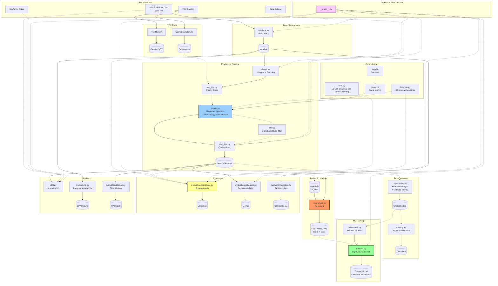

# MALCA: Multi-timescale ASAS-SN Light Curve Analysis


MALCA is a Bayesian event-detection pipeline for finding dimming and dipping events in ASAS-SN photometric light curves. It fits per-camera Gaussian process baselines, scores candidate events via marginal log-likelihood grids and leave-one-out posterior probabilities, and applies multi-stage quality filters to produce a catalog of dipper candidates. Post-detection modules add multi-wavelength characterization (Gaia, WISE, dust maps) and astrophysical classification.

## Contents

- [Install](#install)
  - [Input Files](#input-files)
  - [Dependencies](#dependencies)
- [Quick Start](#quick-start)
- [Pipeline Architecture](#pipeline-architecture)
- [Usage Guide](#usage-guide)
  - [Detection Pipeline](#detection-pipeline)
  - [Individual Commands](#individual-commands)
  - [Candidate Review](#candidate-review)
- [Output Directory Structure](#output-directory-structure)
  - [Integrated Pipeline](#integrated-pipeline)
  - [Standalone Module Outputs](#standalone-module-outputs)
- [Citation](#citation)
- [License](#license)

## Install

```bash
# Requires Python >= 3.9
git clone https://github.com/calderlen/malca.git && cd malca
pip install -e "."          # installs all runtime + test dependencies
```

Conda option:

```bash
conda env create -f environment.yml
conda activate malca
```

### Input Files
- Per-mag-bin directories: `<lcsv2_root>/<mag_bin>/`
  - Index CSVs: `index*.csv` with columns like `asas_sn_id, ra_deg, dec_deg, pm_ra, pm_dec, ...`
- Light curves: `lc<num>_cal/` folders containing `<asas_sn_id>.dat2`
- Optional catalogs:
  - VSX crossmatch: `input/vsx/asassn_x_vsx_matches_20250919_2252.csv` (pre-crossmatched with columns: asas_sn_id, sep_arcsec, class)
  - Raw VSX: `input/vsx/vsxcat.090525.csv` (used by `vsx/filter.py` to generate crossmatch)
  - Note: Bright nearby star (BNS) filtering is handled upstream by ASAS-SN during LC generation

### Dependencies
- Core + runtime modules: numpy, pandas, scipy, numba, astropy, celerite2, matplotlib, tqdm, pyarrow
- Review + plotting: dash, dash-bootstrap-components, plotly
- Characterization + catalog access: astroquery, dustmaps3d, pyvo, banyan-sigma, requests
- ML utilities: lightgbm, joblib

## Quick Start
```bash
# Build manifest (source_id → path index)
malca manifest --index-root /path/to/lcsv2 --lc-root /path/to/lcsv2 \
    --mag-bin 13_13.5 --out output/manifest.parquet --workers 10

# Run event detection pipeline
malca pipeline --mag-bin 13_13.5 --workers 10 \
    --lc-root /path/to/lcsv2 --index-root /path/to/lcsv2 \
    --output output/results.parquet --min-mag-offset 0.1

# Validate results against known candidates (no raw data needed)
malca validate --results output/results.parquet

# Plot light curves
malca plot --input /path/to/lc123.dat2 --out-dir output/plots

# Apply quality filters
malca filter --input output/results.parquet --output output/filtered.parquet

# Multi-wavelength characterization (post-detection)
malca characterize --input output/filtered.parquet --output output/characterized.parquet --dust --starhorse input/starhorse/starhorse2021.parquet

# Get help for any command
malca --help
malca pipeline --help
```

Minimal split workflow (cluster -> home):

```bash
# On cluster: run upstream/raw-dependent steps and export transfer bundle
malca pipeline --stage cluster --mag-bin 13_13.5 --out-dir output/run_001 \
    --export-bundle output/run_001_bundle.zip

# On home machine: import bundle and run downstream/catalog steps only
malca pipeline --stage home --out-dir output/run_001 \
    --import-bundle ~/Downloads/run_001_bundle.zip
```

## Pipeline Architecture


```mermaid
graph TB
    subgraph "Data Sources"
        RAW[ASAS-SN Raw Data<br/>.dat2 files]
        SKY[SkyPatrol CSVs]
        VSX_CAT[VSX Catalog]
        GAIA[Gaia Catalog]
    end

    subgraph "Core Libraries"
        UTILS[utils.py<br/>LC I/O, cleaning, bad camera filtering]
        BASE[baseline.py<br/>GP/median baselines]
        STATS_LIB[stats.py<br/>Statistics]
        SCORE_LIB[score.py<br/>Event scoring]
    end

    subgraph "Data Management"
        MAN[manifest.py<br/>Build index]
        RAW --> MAN
        MAN --> MAN_OUT[(Manifest)]
    end

    subgraph "VSX Tools"
        VSX_FILT[vsx/filter.py]
        VSX_CROSS[vsx/crossmatch.py]
        VSX_CAT --> VSX_FILT
        VSX_CAT --> VSX_CROSS
        VSX_FILT --> VSX_CLEAN[(Cleaned VSX)]
        VSX_CROSS --> VSX_MATCH[(Crossmatch)]
    end

    subgraph "Production Pipeline"
        EV_FILT[detect.py<br/>Wrapper + Batching]
        PREFILT[pre_filter.py<br/>Quality filters]
        EVENTS[events.py<br/>Bayesian Detection<br/>+ Morphology + Recurrence]
        AMP_FILT[filter.py<br/>Signal amplitude filter]
        POSTFILT[post_filter.py<br/>Quality filters]

        MAN_OUT --> EV_FILT
        VSX_MATCH -.-> PREFILT
        EV_FILT --> PREFILT
        PREFILT --> EVENTS
        EVENTS --> POSTFILT
        EVENTS -.-> AMP_FILT
        AMP_FILT -.-> POSTFILT
        GAIA -.-> POSTFILT
        POSTFILT --> CAND[(Final Candidates)]
    end

    subgraph "Post-Detection"
        CHAR[characterize.py<br/>Multi-wavelength<br/>+ Galactic coords]
        CLASSIFY[classify.py<br/>Dipper classification]

        CAND -.-> CHAR
        CHAR --> CHAR_OUT[(Characterized)]
        CHAR_OUT -.-> CLASSIFY
        CLASSIFY --> CLASSIFY_OUT[(Classified)]
    end

    subgraph "Review & Labeling"
        REVIEW_DB[(review.db<br/>SQLite)]
        REVIEW_APP[review/app.py<br/>Dash GUI]

        CAND -.-> REVIEW_DB
        REVIEW_DB --> REVIEW_APP
        REVIEW_APP --> LABELS[(Labeled Reviews<br/>score + class)]
    end

    subgraph "ML Training"
        ML_FEAT[ml/features.py<br/>Feature curation]
        ML_TRAIN[ml/train.py<br/>LightGBM classifier]

        LABELS -.-> ML_TRAIN
        CHAR_OUT -.-> ML_FEAT
        ML_FEAT --> ML_TRAIN
        ML_TRAIN --> ML_OUT[(Trained Model<br/>+ Feature importance)]
    end

    subgraph "Evaluation"
        REPRO[evaluation/reproduce.py<br/>Known objects]
        VALID[evaluation/validation.py<br/>Results validation]
        INJ[evaluation/injection.py<br/>Synthetic dips]

        MAN_OUT -.-> REPRO
        CAND -.-> REPRO
        REPRO --> REPRO_OUT[(Validation)]

        CAND --> VALID
        VALID --> VALID_OUT[(Metrics)]

        MAN_OUT --> INJ
        INJ --> INJ_OUT[(Completeness)]
    end

    subgraph "Analysis"
        PLOT[plot.py<br/>Visualization]
        LTV[ltv/pipeline.py<br/>Long-term variability]
        FP[evaluation/attrition.py<br/>Filter attrition]

        CAND --> PLOT
        RAW -.-> PLOT
        SKY -.-> PLOT

        MAN_OUT --> LTV
        LTV --> LTV_OUT[(LTV Results)]

        CAND --> FP
        FP --> FP_OUT[(FP Report)]
    end

    subgraph "Command Line Interface"
        CLI[__main__.py]
        CLI -.-> MAN
        CLI -.-> EV_FILT
        CLI -.-> REPRO
        CLI -.-> VALID
        CLI -.-> PLOT
        CLI -.-> POSTFILT
        CLI -.-> REVIEW_APP
        CLI -.-> ML_TRAIN
    end

    %% Dependencies
    UTILS -.-> EVENTS
    UTILS -.-> REPRO
    BASE -.-> EVENTS
    BASE -.-> REPRO
    SCORE_LIB -.-> EVENTS
    STATS_LIB -.-> SCORE_LIB

    %% Styling
    style EVENTS fill:#9cf,stroke:#333,stroke-width:2px
    style REPRO fill:#ff9,stroke:#333,stroke-width:2px
    style CLI fill:#fcf,stroke:#333,stroke-width:2px
    style REVIEW_APP fill:#f96,stroke:#333,stroke-width:2px
    style ML_TRAIN fill:#9f9,stroke:#333,stroke-width:2px
```

**Key Components:**
- **Production**: `manifest.py` → `pre_filter.py` → `events.py` → `post_filter.py`
- **Post-detection**: `characterize.py` (Gaia, dust, galactic coords) → `classify.py`
- **Review**: `review/app.py` (Dash GUI) → labeled training set
- **ML**: `ml/features.py` (107 curated features) → `ml/train.py` (LightGBM classifier)
- **Evaluation**: `evaluation/reproduce.py`, `evaluation/validation.py`, `evaluation/injection.py`
- **CLI**: Unified interface via `malca [command]`

See [docs/architecture.md](docs/architecture.md) for detailed documentation.

## Usage Guide

### Detection Pipeline

The full detection workflow has three steps: build a manifest, run detection with batching/resume, then post-filter.

1) Build a manifest (map IDs -> light-curve directories):
   ```bash
   malca manifest --index-root /path/to/lcsv2 --lc-root /path/to/lcsv2 \
       --mag-bin 13_13.5 --out output/lc_manifest_13_13.5.parquet --workers 10
   ```
2) Pre-filter and run events in batches with resume support:
   ```bash
   malca pipeline --mag-bin 13_13.5 --workers 10 \
       --min-time-span 100 --min-points-per-day 0.05 --min-cameras 2 \
       --vsx-crossmatch input/vsx/asassn_x_vsx_matches_20250919_2252.csv \
       --batch-size 2000 \
       --lc-root /path/to/lcsv2 \
       --index-root /path/to/lcsv2 \
       --output output/lc_events_results_13_13.5.parquet \
       --trigger-mode posterior_prob --baseline-func gp --min-mag-offset 0.1
   ```
   - The pipeline command builds/loads the manifest, runs pre-filters, then calls `events.py` in batches.
   - Resume: if interrupted, skips already-processed paths using the checkpoint file.
   - VSX tags are saved to `prefilter/vsx_tags/` and merged into results.
   - To disable VSX handling: `--skip-vsx`. To tag instead of filter: `--vsx-mode tag`.

3) Post-filter events:
   ```bash
   malca post_filter --input output/lc_events_results_13_13.5.parquet \
       --output output/lc_events_results_13_13.5_filtered.parquet

   # With custom thresholds
   malca post_filter --input results.parquet --output filtered.parquet \
       --min-bayes-factor 20 --min-run-points 3 --apply-morphology
   ```
   - **Implemented filters**: posterior strength, run robustness, score, morphology, periodicity, Gaia RUWE, periodic catalog

4) Optional: tune post-filter behavior directly from `malca pipeline` / `malca detect`.
   ```bash
   # Keep pipeline defaults but disable score-based rejection
   malca pipeline --mag-bin 13_13.5 --skip-score-filter

   # Enable stricter optional validators
   malca pipeline --mag-bin 13_13.5 \
       --apply-morphology --min-delta-bic 12 \
       --apply-periodicity-validation --periodicity-n-bootstrap 2000 \
       --gaia-reject --periodic-catalog-reject
   ```
   - **Defaults in pipeline**: evidence strength, run robustness, score, Gaia RUWE, and periodic-catalog validation are on; morphology and periodicity-validation are off.
   - **Control flags now available in pipeline**:
     - Evidence/run: `--skip-evidence-strength`, `--allow-infinite-local-bf`, `--skip-run-robustness`, `--min-run-count`, `--post-filter-min-run-points`, `--post-filter-min-run-cameras`
     - Morphology/score: `--apply-morphology`, `--dip-morphology`, `--jump-morphology`, `--min-delta-bic`, `--skip-score-filter`, `--min-score`
     - Validators: `--apply-periodicity-validation` (+ periodicity knobs), `--skip-gaia-ruwe-validation|--gaia-reject`, `--skip-periodic-catalog-validation|--periodic-catalog-reject`

**Detect options:**
```bash
# logBF triggering (faster)
malca pipeline --mag-bin 13_13.5 --workers 8 \
    --lc-root /path/to/lcsv2 --index-root /path/to/lcsv2 \
    --output output/events_logbf.parquet --trigger-mode logbf \
    --baseline-func gp_masked --min-mag-offset 0.1

# Multiple mag bins (writes one output per bin)
malca pipeline --mag-bin 12_12.5 12.5_13 13_13.5 \
    --lc-root /path/to/lcsv2 --index-root /path/to/lcsv2 \
    --output output/lc_events_results.parquet --trigger-mode logbf
```

### Individual Commands

#### malca manifest

```bash
malca manifest --index-root <index_dir> --lc-root <lc_dir> \
    --mag-bin 12_12.5 --out output/lc_manifest.parquet
```

#### malca events

Run event detection directly (without the pipeline orchestrator):
```bash
malca events --input /path/to/lc*_cal/*.dat2 --output output/results.parquet --workers 10

# With signal amplitude filtering (requires |event_mag - baseline_mag| > 0.1)
malca events --input /path/to/lc*_cal/*.dat2 --output output/results.parquet \
    --workers 10 --min-mag-offset 0.1
```
- Default Bayesian grid is 12x12. Change p-grid with `--p-points`.
- Output includes per-event morphology fit parameters (`best_amp`, `best_t0`, `best_alpha`, `best_tau`, `best_morph`, `delta_bic`, `width_param`, `symmetry_score`) and recurrence statistics (`is_single_event`, `inter_event_spacing_median/std`, `amplitude_consistency`, `duration_consistency`) for both dips and jumps.

#### malca pre_filter

```bash
malca pre_filter --help
```
- Expects columns `asas_sn_id` and `path` pointing to lc_dir.
- VSX handling: default is filter (drops VSX matches but keeps `sep_arcsec` and `class` on survivors). Use `--vsx-mode tag` to keep all matches and only tag.

#### malca post_filter

```bash
malca post_filter --input output/results.parquet --output output/results_filtered.parquet
```

#### malca filter

```bash
malca filter --input output/results.parquet --output output/filtered.parquet
```

#### malca plot

```bash
# Single file
malca plot --input /path/to/lc123.dat2 --out-dir output/plots --format png

# Multiple files (glob patterns supported)
malca plot --input input/skypatrol2/*.csv --out-dir output/plots --skip-events

# All files from events.py results
malca plot --events output/lc_events_results_13_13.5_filtered.parquet --out-dir output/plots
```

**Note:** Event scores are computed automatically during detection and included in the results table (dipper_score, dipper_n_dips, dipper_n_valid_dips columns).

Legacy batch plotting: `malca old.plot_results_bayes /path/to/*.csv --results-csv output/lc_events_results_13_13.5.csv --out-dir output/plots`

#### malca injection

```bash
# Full run
malca injection --workers 10

# Quick test with limited trials
malca injection --max-trials 1000 --workers 10

# Custom manifest and output directory
malca injection --manifest /path/to/manifest.parquet --out-dir output/injection
```

See [Injection Testing output](#injection-testing) for the directory layout.

- Injects synthetic dips with skew-normal profiles onto real observed light curves
- Preserves real cadence, systematics, and noise characteristics
- Supports resume for long-running parameter sweeps

Python API:
```python
from malca.evaluation.injection import (
    load_efficiency_cube,
    plot_efficiency_all,
    plot_efficiency_mag_slices,
    plot_efficiency_marginalized,
    plot_efficiency_threshold_contour,
    plot_efficiency_3d,
)

cube = load_efficiency_cube("output/injection/cubes/efficiency_cube.npz")
plot_efficiency_marginalized(cube, axis="mag", output_path="avg_over_mag.png")
plot_efficiency_threshold_contour(cube, threshold=0.5, output_path="depth_at_50pct.png")
```

#### malca reproduce

```bash
# Re-run detection on raw data (requires manifest and .dat2 files)
malca reproduce --manifest output/lc_manifest.parquet \
    --candidates my_targets.csv --out-dir output/results_repro --workers 10
```
**Note**: Reproduction uses Bayesian detection.

#### malca validate

```bash
# Auto-discover and validate ALL results for LOO method
malca validate --method loo

# Auto-discover for Bayes Factor method
malca validate --method bf

# Filter to specific magnitude bin
malca validate --method loo --mag-bin 13_13.5

# Direct file specification
malca validate --results output/results.parquet

# Validate latest detect run output (output/runs/<timestamp>/results)
malca validate --latest-run

# Validate a specific detect run directory
malca validate --run-dir output/runs/20250119_1349

# With custom candidates
malca validate --method loo --candidates my_targets.csv -v

# Reproduce on built-in candidates using local SkyPatrol CSVs
malca validate --candidates brayden_candidates --skypatrol-dir input/skypatrol2 \
    --method bf --workers 4

# Validate using a direct results file path
malca validate --results output/events_logbf.parquet
```

#### malca characterize

After detecting dipper candidates, characterize them using multi-wavelength data:

```bash
malca characterize \
  --input output/filtered.parquet \
  --output output/characterized.parquet \
  --dust \
  --starhorse input/starhorse/starhorse2021.parquet
```

**Features:**
- **Gaia DR3 Queries**: Astrometry, astrophysics (Teff, logg, metallicity, distance), 2MASS/AllWISE photometry
- **3D Dust Extinction**: All-sky coverage via `dustmaps3d` (Wang et al. 2025, ~350MB)
- **YSO Classification**: Koenig & Leisawitz (2014) IR color-color diagram with dust correction
- **Galactic Coordinates**: Galactic longitude/latitude (l, b) from ra/dec
- **Galactic Population**: Thin/thick disk classification using metallicity or StarHorse ages
- **StarHorse** (if provided): Stellar ages, masses, distances from local catalog join
- **Auxiliary Catalog Crossmatches** (Tzanidakis+2025):
  - BANYAN Σ: Young stellar association membership probabilities
  - IPHAS DR2: Hα emission detection for Galactic plane sources
  - Star-forming regions: Proximity check to known SFRs (Prisinzano+2022)
  - Open clusters: Cantat-Gaudin+2020 membership crossmatch
  - unWISE/unTimely: Mid-IR variability z-scores
- **Caching**: Gaia results cached locally to speed up repeated analyses

**Setup:**
```bash
# Dust maps auto-download on first use (~350MB)
# For StarHorse, download catalog manually:
# https://cdsarc.cds.unistra.fr/viz-bin/cat/I/354
```

**Output columns:**
- `source_id`, `ra`, `dec`, `parallax`, `distance_gspphot`
- `tmass_j`, `tmass_h`, `tmass_k`, `unwise_w1`, `unwise_w2`
- `A_v_3d`, `ebv_3d` (3D dust extinction)
- `H_K`, `W1_W2`, `yso_class` (Class I/II/Transition Disk/Main Sequence)
- `population` (thin_disk/thick_disk from metallicity or age)
- `age50`, `mass50` (if StarHorse provided)
- `gal_l`, `gal_b` (Galactic coordinates)
- Auxiliary crossmatches (Tzanidakis+2025):
  - `banyan_field_prob`, `banyan_best_assoc` (BANYAN Σ membership)
  - `iphas_r_ha`, `iphas_ha_excess` (IPHAS Hα)
  - `near_sfr`, `sfr_name` (star-forming region proximity)
  - `cluster_name`, `cluster_age_myr` (open cluster membership)
  - `unwise_w1_zscore`, `unwise_w2_zscore`, `unwise_w1_var` (IR variability)

#### malca classify

```bash
malca classify --input output/characterized.parquet --output output/classified.parquet
```

#### malca stats

```bash
malca stats /path/to/lc123.dat2
```

#### malca attrition

```bash
malca attrition --pre output/pre.parquet --post output/post.parquet
```

### Candidate Review

```bash
# Launch Dash review GUI (keyboard-driven)
malca review --db ~/.cache/malca/review.db --plot-dir output/runs/YOUR_RUN/plots
```

**Dash GUI features:**
- Light curve plot display with grouped, collapsible metadata panels (~146 fields across 17 sections)
- Interest scoring (0-5) via number keys or clickable buttons
- Event class labeling (single-select): `dipper`, `yso`, `microlensing`, `flare`, `eclipsing_binary`, `instrumental`, `unknown_interesting`, `not_real`
- Leader-key class shortcut: `C`+key — class badges are also clickable
- Sidebar with import, queue filtering (unreviewed, score range, sort), characterize-on-import, and export controls
- Freeform notes, followup flag, review pass tracking, recent activity log
- Export reviewed candidates to CSV/Parquet

#### malca ml_train

Train a baseline classifier on reviewed labels:
```bash
malca ml_train --db output/review/review.db --out-dir output/ml
```
- Uses a curated set of 107 physics-driven features (`malca/ml/features.py`)
- Trains a LightGBM classifier on `event_class` labels from the review database
- Outputs feature importance rankings and cross-validation metrics

#### malca vsx-filter

Build the cleaned ASAS-SN index and filtered VSX catalog:
```bash
malca vsx-filter --help
malca vsx-filter --vsx-file input/vsx/vsxcat.090525.csv --masked-dir /path/to/lcsv2_masked --output-dir input/vsx
malca vsx-filter --stamp 20260213_120000   # timestamped output filenames
```
- Reads the raw fixed-width VSX catalog and filters out unwanted variability classes (eclipsing binaries, supernovae, AGN, etc.)
- Concatenates masked ASAS-SN index CSVs from all magnitude bins
- Outputs `asassn_catalog.csv` and `vsx_cleaned.csv` (or timestamped variants with `--stamp`)

#### malca vsx-crossmatch

Crossmatch ASAS-SN sources with VSX by position (with proper-motion correction):
```bash
malca vsx-crossmatch --help
malca vsx-crossmatch --asassn-csv input/vsx/asassn_catalog.csv --vsx-csv input/vsx/vsx_cleaned.csv
malca vsx-crossmatch --radius 5.0 --stamp 20260213_120000
```
- Propagates ASAS-SN coordinates from epoch 2016.0 to 2000.0 using proper motions
- Default match radius is 3 arcseconds
- Outputs `asassn_x_vsx_matches_{stamp}.csv` to `input/vsx/`

## Output Directory Structure

### Integrated Pipeline

When running `malca pipeline`, the following directory structure is created for complete provenance tracking:

```
output/runs/20250121_143052/          # Timestamp-based run directory
├── run_params.json                   # Detection parameters (detect.py)
├── run_summary.json                 # Detection results stats (detect.py)
├── filter_log.json                   # Filtering parameters & stats (post_filter.py)
├── plot_log.json                     # Plotting parameters (plot.py)
├── run.log                           # Simple text log with paths
│
├── manifests/                        # Manifest files
│   └── lc_manifest_{mag_bin}.parquet
│
├── prefilter/                        # Pre-filtering results
│   ├── lc_filtered_{mag_bin}.parquet
│   ├── lc_stats_checkpoint_{mag_bin}.parquet
│   ├── rejected_pre_filter_{mag_bin}.csv
│   └── vsx_tags/
│       └── vsx_tags_{mag_bin}.csv
│
├── paths/                            # Input paths
│   └── filtered_paths_{mag_bin}.txt
│
├── results/                          # Detection results
│   ├── lc_events_results.parquet     # Raw detection output (includes dipper_score)
│   ├── lc_events_results_PROCESSED.txt  # Checkpoint log
│   ├── lc_events_results_filtered.parquet   # After post_filter.py
│   └── rejected_post_filter.csv      # Post-filter rejections
│
└── plots/                            # Visualizations (plot.py)
    ├── {source_id}_dips.png
    ├── {source_id}_dips.png
    └── ...
```

**Key Features:**
- **JSON logs track full provenance**: Every parameter and result is logged for reproducibility
- **Self-contained runs**: Each timestamped directory contains everything needed to reproduce the analysis
- **Checkpoint support**: Detection runs can be interrupted and resumed using `*_PROCESSED.txt` files
- **Rejection tracking**: Both pre-filter and post-filter rejections are logged with reasons

**JSON Log Contents:**
- `run_params.json`: All pre-filter and detection parameters (thresholds, workers, baseline settings)
- `run_summary.json`: Manifest statistics, pre-filter rejection breakdown, detection results
- `filter_log.json`: Filter toggles, thresholds, input/output counts, rejection breakdown
- `plot_log.json`: Plotting parameters, GP settings, number of plots generated

**Note:** Event scores (dipper_score, dipper_n_dips, dipper_n_valid_dips) are automatically computed during detection for significant events and included in the results table.

### Standalone Module Outputs

#### Injection Testing

```
output/injection/                     # Default output directory
├── results/
│   ├── injection_results.parquet     # Trial-by-trial injection results
│   └── injection_results_PROCESSED.txt  # Checkpoint for resume
│
├── cubes/
│   └── efficiency_cube.npz           # 3D efficiency cube (depth × duration × mag)
│
└── plots/
    ├── mag_slices/                   # Per-magnitude 2D heatmaps
    │   ├── mag_12.0_efficiency.png
    │   ├── mag_13.0_efficiency.png
    │   └── ...
    ├── efficiency_marginalized_*.png  # Averaged over one axis
    ├── depth_at_*pct_efficiency.png   # Threshold contour maps
    └── efficiency_3d_volume.html      # Interactive 3D (if plotly installed)
```

#### Detection Rate

```
output/detection_rate/                # Default base directory
├── 20250121_143052/                  # Timestamped run directory
│   ├── run_params.json                # Full parameter dump
│   ├── results/
│   │   ├── detection_rate_results.parquet
│   │   ├── detection_rate_results_PROCESSED.txt  # Checkpoint
│   │   └── detection_summary.json     # Detection rate summary
│   └── plots/
│       ├── detection_rate_vs_mag.png
│       ├── detection_duration_dist.png
│       └── detection_depth_dist.png
│
├── 20250121_150318_custom_tag/       # Optional --run-tag appended
│   └── ...
│
└── latest -> 20250121_150318_custom_tag/  # Symlink to latest run
```

#### Multi-Wavelength Characterization

```
output/
├── characterized.parquet             # Single output file with added columns:
                                      #   - Gaia astrometry & photometry
                                      #   - 3D dust extinction (A_v_3d, ebv_3d)
                                      #   - YSO classification (yso_class)
                                      #   - Galactic population (thin_disk/thick_disk)
                                      #   - StarHorse ages/masses (if provided)
                                      #   - Auxiliary crossmatches (BANYAN Σ, IPHAS, etc.)
└── gaia_cache/                       # Gaia query cache (created when cache is used)
    └── gaia_results_{hash}.parquet
```

#### Dipper Classification

```
output/
└── classified.parquet                # Single output file with added columns:
                                      #   - P_eb, P_cv, P_starspot, P_disk
                                      #   - yso_class
                                      #   - a_circ_au, transit_prob
                                      #   - final_class (EB/CV/Starspot/Disk/YSO/Unknown)
```

#### Manifest Building

```
output/
└── lc_manifest_{mag_bin}.parquet     # Single parquet file with:
                                      #   - asas_sn_id
                                      #   - ra_deg, dec_deg
                                      #   - lc_dir (directory path)
                                      #   - dat_path (full .dat2 path)
                                      #   - dat_exists (bool)
```

## Citation

If you use MALCA or any part of its codebase in published research, please cite this repository:

```
Lenhart, C. (2025). MALCA: Multi-timescale ASAS-SN Light Curve Analysis [Software].
https://github.com/calderlen/malca
```

## License

This project is licensed under the GNU General Public License v3.0. See [LICENSE](LICENSE) for details.
