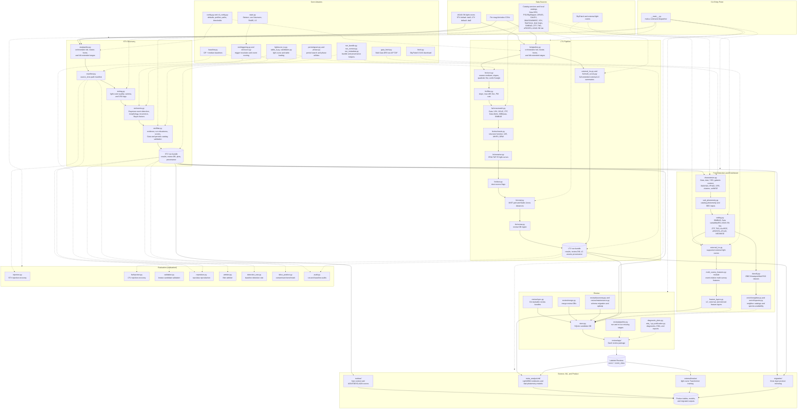

# MALCA: Multi-timescale ASAS-SN Light Curve Analysis


MALCA is a Bayesian event-detection pipeline for finding dimming and dipping events in ASAS-SN photometric light curves. It fits per-camera Gaussian process baselines, scores candidate events via marginal log-likelihood grids and leave-one-out posterior probabilities, and applies multi-stage quality filters to produce a catalog of dipper candidates. Post-detection modules add multi-wavelength characterization (Gaia, WISE, dust maps) and astrophysical classification.

## Contents

- [Install](#install)
  - [Input Files](#input-files)
  - [Dependencies](#dependencies)
- [Quick Start](#quick-start)
- [Pipeline Architecture](#pipeline-architecture)
- [Usage Guide](#usage-guide)
  - [Detection Pipeline](#detection-pipeline)
  - [Individual Commands](#individual-commands)
  - [Candidate Review](#candidate-review)
- [Output Directory Structure](#output-directory-structure)
  - [Integrated Pipeline](#integrated-pipeline)
  - [Standalone Module Outputs](#standalone-module-outputs)
- [Citation](#citation)
- [License](#license)

## Install

```bash
# Requires Python >= 3.9
git clone https://github.com/calderlen/malca.git && cd malca
pip install -e "."          # installs all runtime + test dependencies
```

Conda option:

```bash
conda env create -f environment.yml
conda activate malca
```

### Input Files
- Per-mag-bin directories: `<lcsv2_root>/<mag_bin>/`
  - Index CSVs: `index*.csv` with columns like `asas_sn_id, ra_deg, dec_deg, pm_ra, pm_dec, ...`
- Light curves: `lc<num>_cal/` folders containing `<asas_sn_id>.dat2`
- Optional catalogs:
  - VSX crossmatch: `input/vsx/asassn_x_vsx_matches_20250919_2252.parquet` (pre-crossmatched with columns: asas_sn_id, sep_arcsec, class)
  - Raw VSX: `input/vsx/vsxcat.090525.csv` (used by `vsx/filter.py` to generate crossmatch)
  - Note: Bright nearby star (BNS) filtering is handled upstream by ASAS-SN during LC generation

### Dependencies
- Core + runtime modules: numpy, pandas, scipy, numba, astropy, celerite2, matplotlib, tqdm, pyarrow
- Review + plotting: dash, dash-bootstrap-components, plotly
- Characterization + catalog access: astroquery, dustmaps3d, pyvo, banyan-sigma, requests
- ML utilities: lightgbm

## Quick Start
```bash
# Build manifest (source_id → path index)
malca manifest --index-root /path/to/lcsv2 --lc-root /path/to/lcsv2 --mag-bin 13_13.5 --output output/manifest.parquet --workers 10

# Run event detection pipeline
malca stv-pipeline --mag-bin 13_13.5 --workers 10 --lc-root /path/to/lcsv2 --index-root /path/to/lcsv2 --output-dir output/run_001

# Validate results against known candidates (no raw data needed)
malca validate --results output/results.parquet

# Plot light curves
malca stv-plot --input /path/to/lc123.dat2 --output-dir output/plots

# Apply quality filters
malca stv-filter --input output/results.parquet --output output/filtered.parquet

# Multi-wavelength characterization (post-detection)
malca characterize --input output/filtered.parquet --output output/characterized.parquet --enable-dust --starhorse input/starhorse/starhorse2021.parquet

# Get help for any command
malca --help
malca stv-pipeline --help
```

Minimal split workflow (cluster -> home):

```bash
# On cluster: run upstream/raw-dependent steps and export transfer bundle
malca stv-pipeline --stage cluster --mag-bin 13_13.5 --output-dir output/run_001 --config cluster.toml

# On home machine: import bundle and run downstream/catalog steps only
malca stv-pipeline --stage home --output-dir output/run_001 --config home.toml
```

## Pipeline Architecture


```mermaid
flowchart TB

    %% Data sources
    subgraph sources["Data Sources"]
        RAW["ASAS-SN light curves<br/>STV default .dat3; LTV default .dat2"]
        IDX["Per-mag-bin index CSVs"]
        EXT_SRC["SkyPatrol and external light curves"]
        CAT_SRC["Catalog services and local catalogs<br/>Gaia DR3, PS1/SkyMapper, APASS, GALEX,<br/>2MASS/AllWISE, VSX, StarHorse, dust maps,<br/>SIMBAD, ZTF, TNS, eROSITA, ASAS-SN Var"]
    end

    %% CLI
    subgraph cli["CLI Entry Point"]
        CLI["__main__.py<br/>malca command dispatcher"]
    end

    %% STV
    subgraph stv["STV Discovery"]
        STV_PIPE["stv/pipeline.py<br/>orchestrates full, cluster, home,<br/>and full-extended stages"]
        MAN["manifest.py<br/>source_id-to-path manifest"]
        TAG["stv/tag.py<br/>light-curve quality, camera,<br/>and VSX tags"]
        EVENTS["stv/events.py<br/>Bayesian event detection,<br/>morphology, recurrence, Bayes factors"]
        FILTER["stv/filter.py<br/>evidence, run robustness, scores,<br/>Gaia and periodic-catalog validation"]
        STV_RUN[("STV run bundle<br/>results, review DB, plots, provenance")]
        STV_PIPE --> MAN --> TAG --> EVENTS --> FILTER --> STV_RUN
    end

    RAW --> STV_PIPE
    IDX --> STV_PIPE
    CAT_SRC -.-> TAG
    CAT_SRC -.-> FILTER

    %% Post-detection
    subgraph postdet["Post-Detection and Enrichment"]
        CHAR["characterize.py<br/>Gaia, dust, YSO, galactic context,<br/>BANYAN, IPHAS, SFR, clusters, unWISE"]
        SED["sed_photometry.py<br/>catalog photometry and SED inputs"]
        VET["vetting.py<br/>SIMBAD, Gaia variability/EB, ASAS-SN Var,<br/>ZTF, TNS, ALeRCE, eROSITA, ATLAS, NEOWISE"]
        CLASS["classify.py<br/>EB/CV/starspot/disk/YSO classes"]
        EXT_LC["external_lcs.py<br/>supported external light curves"]
        MULTI["multi_survey_features.py module<br/>event-relative multi-survey features"]
        LAYERS["feature_layers.py<br/>LC, external, and derived feature layers"]
        ENRICH["enrich/neighbor.py and enrich/spectra.py<br/>neighbor catalogs and spectra availability"]
        CHAR --> SED --> VET --> CLASS
        VET --> EXT_LC --> MULTI --> LAYERS
        CLASS --> ENRICH
    end

    STV_RUN --> CHAR
    CAT_SRC -.-> CHAR
    CAT_SRC -.-> VET
    EXT_SRC -.-> EXT_LC

    %% LTV
    subgraph ltvpipe["LTV Pipeline"]
        LTV_PIPE["ltv/pipeline.py<br/>orchestrates full, cluster, home,<br/>and full-extended stages"]
        LTV_CORE["ltv/core.py<br/>season medians, slopes,<br/>quadratic fits, Lomb-Scargle"]
        LTV_FILTER["ltv/filter.py<br/>slope, max-diff, Dec, PM cuts"]
        LTV_CROSS["ltv/crossmatch.py<br/>Gaia, VSX, OGLE, ZTF,<br/>Gaia Alerts, MilliQuas, SIMBAD"]
        LTV_STOCH["ltv/stochastic.py<br/>structure function, IAR, MHPS, DRW"]
        LTV_NEO["ltv/neowise.py<br/>IRSA TAP IR light curves"]
        LTV_DUST["ltv/dust.py<br/>dust excess flags"]
        LTV_CMD["ltv/cmd.py<br/>MIST grid and Bailer-Jones distances"]
        LTV_EXT["external_lcs.py and ltv/multi_survey.py<br/>full-extended external-LC summaries"]
        LTV_REVIEW["ltv/review.py<br/>review DB ingest"]
        LTV_RUN[("LTV run bundle<br/>results, review DB, LC assets, provenance")]
        LTV_PIPE --> LTV_CORE --> LTV_FILTER --> LTV_CROSS --> LTV_STOCH
        LTV_STOCH --> LTV_NEO --> LTV_DUST --> LTV_CMD --> LTV_REVIEW --> LTV_RUN
        LTV_PIPE --> LTV_EXT --> LTV_RUN
    end

    RAW --> LTV_PIPE
    IDX --> LTV_PIPE
    CAT_SRC -.-> LTV_CROSS
    CAT_SRC -.-> LTV_CMD
    EXT_SRC -.-> LTV_EXT

    %% Review
    subgraph reviewgrp["Review"]
        STORE["store.py<br/>SQLite candidate DB"]
        APP["review/app/<br/>Dash review package"]
        RPIPE["review/pipeline.py<br/>run and re-run missing stages"]
        SYNC["review/sync.py<br/>Git-trackable review bundles"]
        RMERGE["review/merge.py<br/>merge review DBs"]
        TAX["review/taxonomy.py and review/maintenance.py<br/>schema migration and upkeep"]
        RDIAG["diagnostic_plots.py, eda_*.py, publication.py<br/>diagnostics, EDA, and exports"]
        STORE --> APP
        RPIPE -.-> APP
        SYNC --> STORE
        RMERGE --> STORE
        TAX --> STORE
        RDIAG -.-> APP
    end

    STV_RUN --> STORE
    LTV_RUN --> STORE
    LAYERS -.-> STORE
    ENRICH -.-> STORE
    APP --> LABELS[("Labeled Reviews<br/>score + event_class")]

    %% Science, ML, and product outputs
    subgraph productgrp["Science, ML, and Product"]
        NUCLEAR["nuclear/<br/>host context and AGN/TDE/CLAGN scores"]
        ML["meta_analysis/ml/<br/>LightGBM notebooks and bad-photometry models"]
        MALCAT["external/malcat<br/>light-curve Transformer training"]
        MIGRATE["migration/<br/>three-layer product mirroring"]
        PRODUCT[("Product tables, models, and migrated outputs")]
        NUCLEAR --> PRODUCT
        ML --> PRODUCT
        MALCAT --> PRODUCT
        MIGRATE --> PRODUCT
    end

    STV_RUN --> NUCLEAR
    LAYERS --> ML
    LABELS --> ML
    LABELS --> MALCAT
    STV_RUN --> MIGRATE
    LTV_RUN --> MIGRATE

    %% Evaluation
    subgraph evalgrp["Evaluation (evaluation/)"]
        INJ["injection.py<br/>STV injection-recovery"]
        LTV_INJ["ltv/injection.py<br/>LTV rejection-recovery"]
        VALID["validation.py<br/>known-candidate validation"]
        REPRO["reproduce.py<br/>raw-data reproduction"]
        ATTR["attrition.py<br/>filter attrition"]
        DET_RATE["detection_rate.py<br/>baseline detection rate"]
        FP_EVAL["false_positive.py<br/>contaminant benchmark"]
        AUDIT["audit.py<br/>run and baseline audits"]
    end

    MAN -.-> INJ
    MAN -.-> DET_RATE
    MAN -.-> REPRO
    STV_RUN -.-> VALID
    STV_RUN -.-> ATTR
    STV_RUN -.-> FP_EVAL
    LTV_RUN -.-> LTV_INJ
    STV_RUN -.-> AUDIT
    LTV_RUN -.-> AUDIT

    %% Core libraries
    subgraph corelibs["Core Libraries"]
        CONFIG["config.py and cli_config.py<br/>defaults, profiles, paths, thresholds"]
        IO["lightcurve_io.py, table_io.py, candidates.py<br/>light-curve and table loading"]
        BASE["baseline.py<br/>GP + median baselines"]
        TRIG["stv/triggering.py and stv/score.py<br/>trigger resolution and event scoring"]
        STATS_LIB["stats.py<br/>Stetson, von Neumann, RoMS, LS"]
        PERIOD_LIB["periodogram.py and phase.py<br/>period search and phase utilities"]
        FETCH_LIB["fetch.py<br/>SkyPatrol V1/V2 download"]
        GAIA_FETCH["gaia_fetch.py<br/>Bulk Gaia DR3 via AIP TAP"]
        BUNDLE_LIB["run_bundle.py, run_context.py, run_metadata.py<br/>bundle and provenance helpers"]
    end

    CONFIG -.-> STV_PIPE
    CONFIG -.-> LTV_PIPE
    IO -.-> MAN
    IO -.-> LTV_CORE
    BASE -.-> EVENTS
    TRIG -.-> EVENTS
    STATS_LIB -.-> TRIG
    PERIOD_LIB -.-> FILTER
    FETCH_LIB -.-> EXT_LC
    GAIA_FETCH -.-> CHAR
    BUNDLE_LIB -.-> STV_RUN
    BUNDLE_LIB -.-> LTV_RUN
    BASE -.-> REPRO

    CLI -.-> stv
    CLI -.-> postdet
    CLI -.-> ltvpipe
    CLI -.-> reviewgrp
    CLI -.-> productgrp
    CLI -.-> evalgrp
```

**Key Components:**
- **CLI and configuration**: `__main__.py` dispatches `malca [command]`; `config.py` and `cli_config.py` centralize defaults, paths, thresholds, and profiles.
- **STV discovery**: `manifest.py` &rarr; `stv/tag.py` &rarr; `stv/events.py` &rarr; `stv/filter.py`, orchestrated by `stv/pipeline.py` with full/cluster/home/full-extended stages and run bundles.
- **Post-detection and enrichment**: `characterize.py`, `sed_photometry.py`, `vetting.py`, `classify.py`, `external_lcs.py`, `multi_survey_features.py`, `feature_layers.py`, and `enrich/` add catalog context, external light curves, feature layers, classifications, and spectra/neighbor products.
- **LTV pipeline**: `ltv/pipeline.py` orchestrates `core.py`, `filter.py`, `crossmatch.py`, `stochastic.py`, `neowise.py`, `dust.py`, `cmd.py`, and `review.py`; full-extended stages add external light curves and LTV multi-survey summaries.
- **Review**: `review/app/` is the Dash review package backed by `review/store.py`, with on-demand stages in `review/pipeline.py`, sync/merge/taxonomy utilities, diagnostics, EDA, and publication helpers.
- **Science, ML, and product tooling**: `nuclear/`, `meta_analysis/ml/`, `external/malcat`, and `migration/` support AGN/TDE/CLAGN context, LightGBM/bad-photometry workflows, Transformer training, and three-layer product exports.
- **Evaluation**: `evaluation/injection.py`, `validation.py`, `reproduce.py`, `attrition.py`, `detection_rate.py`, `false_positive.py`, and `ltv/injection.py` cover discovery validation, injection/recovery, attrition, contaminants, and LTV rejection-recovery.
- **Core libraries**: `lightcurve_io.py`, `table_io.py`, `candidates.py`, `baseline.py`, `stats.py`, `periodogram.py`, `phase.py`, `fetch.py`, `gaia_fetch.py`, and run-bundle helpers provide shared I/O, modeling, catalog access, and provenance support.

## Usage Guide

### Detection Pipeline

The full detection workflow has three steps: build a manifest, run detection with batching/resume, then filter.

1) Build a manifest (map IDs -> light-curve directories):
   ```bash
   malca manifest --index-root /path/to/lcsv2 --lc-root /path/to/lcsv2 --mag-bin 13_13.5 --output output/lc_manifest_13_13.5.parquet --workers 10
   ```
2) Tag and run events in batches with resume support:
   ```bash
   malca stv-pipeline --mag-bin 13_13.5 --workers 10 --lc-root /path/to/lcsv2 --index-root /path/to/lcsv2 --output-dir output/run_13_13.5 --config pipeline.toml
   ```
   - The pipeline command builds/loads the manifest, runs tag checks, then calls `stv/events.py` in batches.
   - Resume: if interrupted, skips already-processed paths using the checkpoint file.
   - VSX tags are saved to `tags/vsx_tags/` and merged into results.
   - Advanced tag, detection, filter, and catalog settings live in `--config` / `--profile`.

3) Filter events:
   ```bash
   malca stv-filter --input output/lc_events_results_13_13.5.parquet --output output/lc_events_results_13_13.5_filtered.parquet

   # With custom thresholds
   malca stv-filter --input results.parquet --output filtered.parquet --min-bayes-factor 20 --min-run-points 3 --apply-morphology
   ```
   - **Implemented filters**: posterior strength, run robustness, score, morphology, periodicity, Gaia RUWE, Gaia PM, multi-catalog periodic consensus

4) Optional: tune filter behavior directly from `malca stv-pipeline`.
   ```bash
   malca stv-pipeline --mag-bin 13_13.5 --config pipeline.toml --profile strict
   ```
   - **Defaults in pipeline**: evidence strength, run robustness, score, Gaia RUWE, Gaia PM, and periodic-catalog consensus validation are on; morphology and periodicity-validation are off.
   - Advanced controls are config/profile keys rather than public `malca stv-pipeline` flags.

**Detect options:**
```bash
# logBF triggering (faster)
malca stv-pipeline --mag-bin 13_13.5 --workers 8 --lc-root /path/to/lcsv2 --index-root /path/to/lcsv2 --output-dir output/events_logbf --config logbf.toml

# Multiple mag bins (writes one output per bin)
malca stv-pipeline --mag-bin 12_12.5 12.5_13 13_13.5 --lc-root /path/to/lcsv2 --index-root /path/to/lcsv2 --output-dir output/multi_bin --config logbf.toml
```

### Individual Commands

#### malca manifest

```bash
malca manifest --index-root <index_dir> --lc-root <lc_dir> --mag-bin 12_12.5 --output output/lc_manifest.parquet
```

#### malca stv-events

Run event detection directly (without the pipeline orchestrator):
```bash
malca stv-events --input /path/to/lc*_cal/*.dat2 --output output/results.parquet --workers 10

# Advanced detection settings are supplied through --config / --profile
malca stv-events --input /path/to/lc*_cal/*.dat2 --output output/results.parquet --workers 10 --config events.toml
```
- Default Bayesian grid is 12x12. Change advanced detection settings through config/profile keys.
- Output includes per-event morphology fit parameters (`best_amp`, `best_t0`, `best_alpha`, `best_tau`, `best_morph`, `delta_bic`, `width_param`, `symmetry_score`) and recurrence statistics (`is_single_event`, `inter_event_spacing_median/std`, `amplitude_consistency`, `duration_consistency`) for both dips and jumps.

#### malca stv-tag

```bash
malca stv-tag --help
```
- Expects columns `asas_sn_id` and `path` pointing to lc_dir.
- VSX handling tags rows with `vsx_sep_arcsec` / `vsx_class` when enabled.

#### malca stv-filter

```bash
malca stv-filter --input output/results.parquet --output output/results_filtered.parquet
```

#### malca stv-plot

```bash
# Single file
malca stv-plot --input /path/to/lc123.dat2 --output-dir output/plots --format png

# Multiple files (glob patterns supported)
malca stv-plot --input input/skypatrol2/*.csv --output-dir output/plots --skip-events

# All files from events.py results
malca stv-plot --results output/lc_events_results_13_13.5_filtered.parquet --output-dir output/plots
```

**Note:** Event scores are computed automatically during detection and included in the results table (dipper_score, dipper_n_dips, dipper_n_valid_dips columns).

#### malca injection

```bash
# Full run
malca injection --workers 10

# Quick test with limited trials
malca injection --max-trials 1000 --workers 10

# Custom manifest and output directory
malca injection --manifest /path/to/manifest.parquet --output-dir output/injection
```

See [Injection Testing output](#injection-testing) for the directory layout.

- Injects synthetic dips with skew-normal profiles onto real observed light curves
- Preserves real cadence, systematics, and noise characteristics
- Supports resume for long-running parameter sweeps

Python API:
```python
from malca.evaluation.injection import (
    load_efficiency_cube,
    plot_efficiency_all,
    plot_efficiency_mag_slices,
    plot_efficiency_marginalized,
    plot_efficiency_threshold_contour,
    plot_efficiency_3d,
)

cube = load_efficiency_cube("output/injection/cubes/efficiency_cube.npz")
plot_efficiency_marginalized(cube, axis="mag", output_path="avg_over_mag.png")
plot_efficiency_threshold_contour(cube, threshold=0.5, output_path="depth_at_50pct.png")
```

#### malca reproduce

```bash
# Re-run detection on raw data (requires manifest and .dat2 files)
malca reproduce --manifest output/lc_manifest.parquet --candidates my_targets.parquet --output-dir output/results_repro --workers 10
```
**Note**: Reproduction uses Bayesian detection.

#### malca ltv-pipeline

LTV commands use the same run-bundle layout as detection runs. By default, new outputs go under `output/runs/ltv`.

```bash
# Full LTV workflow: source metrics, audit filtering, enrichment, and review ingest
malca ltv-pipeline --mag-bin 13_13.5

# Full LTV workflow plus external light curves, LTV multi-survey summaries, and LC assets in the run bundle
malca ltv-pipeline --stage full-extended --full-bundle --mag-bin 13_13.5

# Open the review app
malca review --review-db output/runs/ltv/latest/review/review.db

# Raw-dependent cluster stage only
malca ltv-pipeline --stage cluster --mag-bin 13_13.5 --export-bundle output/ltv_cluster_bundle.zip

# Home/catalog/review stage from an imported bundle
malca ltv-pipeline --stage home --import-bundle output/ltv_cluster_bundle.zip

# Open the migrated March 18 LTV bundle
malca review --review-db output/runs/ltv_march18/review/review.db
```

#### malca validate

```bash
# Auto-discover and validate ALL results for LOO method
malca validate --method loo

# Auto-discover for Bayes Factor method
malca validate --method bf

# Filter to specific magnitude bin
malca validate --method loo --mag-bin 13_13.5

# Direct file specification
malca validate --results output/results.parquet

# Validate latest STV run output (output/runs/stv/<timestamp>/results)
malca validate --latest-run

# Validate a specific STV run directory
malca validate --run-dir output/runs/stv/20250119_1349

# With custom candidates
malca validate --method loo --candidates my_targets.parquet -v

# Reproduce on built-in candidates using local SkyPatrol CSVs
malca validate --candidates brayden_candidates --skypatrol-dir input/skypatrol2 --method bf --workers 4

# Validate using a direct results file path
malca validate --results output/events_logbf.parquet
```

#### malca characterize

After detecting dipper candidates, characterize them using multi-wavelength data:

```bash
malca characterize --input output/filtered.parquet --output output/characterized.parquet --enable-dust --starhorse input/starhorse/starhorse2021.parquet
```

**Features:**
- **Gaia DR3 Queries**: G/BP/RP photometry, astrometry, RUWE, astrophysics (Teff, logg, metallicity, distance), and linked AllWISE context
- **Core color context**: 2MASS, AllWISE, APASS, and GALEX crossmatches; default SED fetches payload photometry plus Pan-STARRS1/SkyMapper and opportunistic SDSS
- **3D Dust Extinction**: All-sky coverage via `dustmaps3d` (Wang et al. 2025, ~350MB)
- **YSO Classification**: Koenig & Leisawitz (2014) IR color-color diagram with dust correction
- **Galactic Coordinates**: Galactic longitude/latitude (l, b) from ra/dec
- **Galactic Population**: Thin/thick disk classification using metallicity or StarHorse ages
- **StarHorse** (if provided): Stellar ages, masses, distances from local catalog join
- **Auxiliary Catalog Crossmatches** (Tzanidakis+2025):
  - BANYAN Σ: Young stellar association membership probabilities
  - IPHAS DR2: Hα emission detection for Galactic plane sources
  - Star-forming regions: Proximity check to known SFRs (Prisinzano+2022)
  - Open clusters: Cantat-Gaudin+2020 membership crossmatch
  - unWISE/unTimely: Mid-IR variability z-scores
- **Caching**: Gaia results cached locally to speed up repeated analyses

**Setup:**
```bash
# Dust maps auto-download on first use (~350MB)
# For StarHorse, download catalog manually:
# https://cdsarc.cds.unistra.fr/viz-bin/cat/I/354
```

**Output columns:**
- `source_id`, `ra`, `dec`, `parallax`, `pmra`, `pmdec`, `ruwe`, `phot_g_mean_mag`, `phot_bp_mean_mag`, `phot_rp_mean_mag`, `bp_rp`, `distance_gspphot`
- `tmass_j`, `tmass_h`, `tmass_k`, `w1`, `w2`, `w3`, `w4`, `apass_b`, `apass_v`, `apass_g`, `apass_r`, `apass_i`, `galex_fuv`, `galex_nuv`
- `A_v_3d`, `ebv_3d` (3D dust extinction)
- `H_K`, `W1_W2`, `yso_class` (Class I/II/Transition Disk/Main Sequence)
- `population` (thin_disk/thick_disk from metallicity or age)
- `age50`, `mass50` (if StarHorse provided)
- `gal_l`, `gal_b` (Galactic coordinates)
- Auxiliary crossmatches (Tzanidakis+2025):
  - `banyan_field_prob`, `banyan_best_assoc` (BANYAN Σ membership)
  - `iphas_r_ha`, `iphas_ha_excess` (IPHAS Hα)
  - `near_sfr`, `sfr_name` (star-forming region proximity)
  - `cluster_name`, `cluster_age_myr` (open cluster membership)
  - `unwise_w1_zscore`, `unwise_w2_zscore`, `unwise_w1_var` (IR variability)

#### malca vetting

Run post-review vetting against external catalogs:

```bash
# Vet all candidates in a characterized parquet
malca vetting output/characterized.parquet -o output/vetted.parquet

# Skip slow modules
malca vetting output/characterized.parquet --no-simbad --no-alerce

# Only vet high-scoring candidates
malca vetting output/characterized.parquet --min-score 3.0

# With crash-resume checkpoint
malca vetting output/characterized.parquet --checkpoint output/vetting_checkpoint.parquet
```

**Modules** (all on by default, disable with `--no-*`):
- **SIMBAD**: Object type, bibliography, cross-IDs
- **Gaia DR3 variability**: Variable flag, classification, score
- **Gaia DR3 eclipsing binaries**: Period, morphology, global ranking
- **Gaia epoch photometry**: Availability, observation count, G-band range
- **ASAS-SN variables**: Variable star catalog crossmatch
- **ZTF variables**: Chen+ 2020 periodic variables (type, period, amplitude)
- **TNS**: Transient Name Server (name, type, redshift, discovery date)
- **ALeRCE**: ZTF broker classifications and stamp probabilities
- **eROSITA**: X-ray detection, flux, separation
- **PM consistency**: Proper motion agreement with host cluster
- **ATLAS** (opt-in, `--atlas-token`): Forced photometry light curves
- **NEOWISE** (opt-in, `--neowise-lc`): Full NEOWISE light curves

**Pipeline default:** vetting runs by default in `malca stv-pipeline`; use `--no-run-vetting` to opt out.

**Vetting is also available during import** in the review app ("Vet on import" toggle). Results are cached per input file so re-imports skip already-vetted candidates.

#### malca classify

```bash
malca classify --input output/characterized.parquet --output output/classified.parquet
```

#### malca dev stats

```bash
malca dev stats /path/to/lc123.dat2
```

#### malca attrition

```bash
malca attrition --pre output/pre.parquet --post output/post.parquet
```

### Candidate Review

```bash
# Launch the Dash review app against an existing STV run
malca review --review-db output/runs/stv/YOUR_RUN/review/review.db

# Optional, if pre-rendered review plots were generated
malca review --review-db output/runs/stv/YOUR_RUN/review/review.db --plot-dir output/runs/stv/YOUR_RUN/plots

# Standalone mode (no plot directory required)
malca review
```

**Dash review app features:**
- Native Plotly light-curve viewer with PNG fallback, camera filtering, and plot presets/overlays (raw points, dip/jump markers, residuals, phase-fold, diagnostics)
- Confidence scoring (`1-4`) via number keys or clickable buttons
- Event class labeling (single-select) with direct key shortcuts and clickable badges: `dipper`, `microlensing`, `flare`, `yso`, `unknown_interesting`, `instrumental`, `other` (toggle off to `unclassified`)
- Collapsible candidate panels with metadata health, vetting banner, external follow-up cards, diagnostic plots, and run-config provenance
- Sidebar queue controls: unreviewed/failed filters, grouped numeric/text/select filters, multi-column sort, open-existing jump, and native camera selection
- Import/fetch workflows: import tables or raw LC files (optional characterize + vet on import), or fetch by ASAS-SN ID, Gaia DR3 ID, or coordinates
- Per-candidate pipeline stage chips with "Run All Missing" / "Re-run Current", plus notes/followup/review-pass tracking and Parquet export

#### malca vsx-filter

Build the cleaned ASAS-SN index and filtered VSX catalog:
```bash
malca vsx-filter --help
malca vsx-filter --vsx-file input/vsx/vsxcat.090525.csv --masked-dir /path/to/lcsv2_masked --output-dir input/vsx
malca vsx-filter --stamp 20260213_120000   # timestamped output filenames
```
- Reads the raw fixed-width VSX catalog and filters out unwanted variability classes (eclipsing binaries, supernovae, AGN, etc.)
- Concatenates masked ASAS-SN index CSVs from all magnitude bins
- Outputs `asassn_catalog.parquet` and `vsx_cleaned.parquet` (or timestamped variants with `--stamp`)

#### malca vsx-crossmatch

Crossmatch ASAS-SN sources with VSX by position (with proper-motion correction):
```bash
malca vsx-crossmatch --help
malca vsx-crossmatch --asassn-table input/vsx/asassn_catalog.parquet --vsx-table input/vsx/vsx_cleaned.parquet
malca vsx-crossmatch --radius 5.0 --stamp 20260213_120000
```
- Propagates ASAS-SN coordinates from epoch 2016.0 to 2000.0 using proper motions
- Default match radius is 3 arcseconds
- Outputs `asassn_x_vsx_matches_{stamp}.parquet` to `input/vsx/`

## Output Directory Structure

### Integrated Pipeline

When running `malca stv-pipeline`, the following directory structure is created for complete provenance tracking:

```
output/runs/stv/20250121_143052/          # Timestamp-based run directory
├── run_params.json                   # STV pipeline parameters (stv/pipeline.py)
├── run_summary.json                 # STV detection results stats (stv/pipeline.py)
├── filter_log.json                   # Filtering parameters & stats (stv/filter.py)
├── plot_log.json                     # Plotting parameters (stv/plot.py)
├── run.log                           # Simple text log with paths
│
├── manifests/                        # Manifest files
│   └── lc_manifest_{mag_bin}.parquet
│
├── tags/                             # Tagging results
│   ├── lc_filtered_{mag_bin}.parquet
│   ├── lc_stats_checkpoint_{mag_bin}.parquet
│   └── rejected_tag_{mag_bin}.parquet
│
├── paths/                            # Input paths
│   └── filtered_paths_{mag_bin}.txt
│
├── results/                          # Detection results
│   ├── lc_events_results.parquet     # Raw detection output (includes dipper_score)
│   ├── lc_events_results_PROCESSED.txt  # Checkpoint log
│   ├── lc_events_results_filtered.parquet   # After stv/filter.py
│   └── rejected_filter.parquet       # Filter rejections
│
├── review/                           # Review database for the run
│   └── review.db
│
└── plots/                            # Optional visualizations (stv/plot.py)
    ├── {source_id}_dips.png
    ├── {source_id}_dips.png
    └── ...
```

**Key Features:**
- **JSON logs track full provenance**: Every parameter and result is logged for reproducibility
- **Self-contained runs**: Each timestamped directory contains everything needed to reproduce the analysis
- **Checkpoint support**: Detection runs can be interrupted and resumed using `*_PROCESSED.txt` files
- **Rejection tracking**: Both tagging and filter rejections are logged with reasons

**JSON Log Contents:**
- `run_params.json`: All tagging and detection parameters (thresholds, workers, baseline settings)
- `run_summary.json`: Manifest statistics, tag rejection breakdown, detection results
- `filter_log.json`: Filter toggles, thresholds, input/output counts, rejection breakdown
- `plot_log.json`: Plotting parameters, GP settings, number of plots generated

**Note:** Event scores (dipper_score, dipper_n_dips, dipper_n_valid_dips) are automatically computed during detection for significant events and included in the results table.

### LTV Run Bundle

LTV run artifacts are stored under `output/runs/ltv/<timestamp>/`, with March 18 migrated to `output/runs/ltv_march18/`.

```
output/runs/ltv/
├── latest -> 20260527_143052
├── 20260527_143052/
│   ├── run_params.json
│   ├── run_summary.json
│   ├── run.log
│   ├── results/
│   │   ├── LTvar13-13.5.parquet
│   │   ├── LTvar13-13.5_filtered.parquet
│   │   ├── LTvar13-13.5_pipeline.parquet
│   │   ├── LTvar13-13.5_external_lcs.parquet
│   │   ├── LTvar13-13.5_ltv_multi_survey.parquet
│   │   └── external_lcs/
│   ├── review/
│   │   └── review.db
│   └── bundle_assets/
│       └── lightcurves/
```

Legacy fixed run directories and migrated LTV bundles are still supported:

```
output/runs/ltv_march18/
├── results/
│   └── LTvar13-13.5_pipeline.parquet
├── review/
│   └── review.db
└── bundle_assets/
    └── lightcurves/
```

### Standalone Module Outputs

#### Injection Testing

```
output/injection/                     # Default output directory
├── results/
│   ├── injection_results.parquet     # Trial-by-trial injection results
│   └── injection_results_PROCESSED.txt  # Checkpoint for resume
│
├── cubes/
│   └── efficiency_cube.npz           # 3D efficiency cube (depth x duration x mag)
│
└── plots/
    ├── mag_slices/                   # Per-magnitude 2D heatmaps
    │   ├── mag_12.0_efficiency.png
    │   ├── mag_13.0_efficiency.png
    │   └── ...
    ├── efficiency_marginalized_*.png  # Averaged over one axis
    ├── depth_at_*pct_efficiency.png   # Threshold contour maps
    └── efficiency_3d_volume.html      # Interactive 3D (if plotly installed)
```

#### Detection Rate

```
output/detection_rate/                # Default base directory
├── 20250121_143052/                  # Timestamped run directory
│   ├── run_params.json                # Full parameter dump
│   ├── results/
│   │   ├── detection_rate_results.parquet
│   │   ├── detection_rate_results_PROCESSED.txt  # Checkpoint
│   │   └── detection_summary.json     # Detection rate summary
│   └── plots/
│       ├── detection_rate_vs_mag.png
│       ├── detection_duration_dist.png
│       └── detection_depth_dist.png
│
├── 20250121_150318_custom_tag/       # Optional --run-tag appended
│   └── ...
│
└── latest -> 20250121_150318_custom_tag/  # Symlink to latest run
```

#### Multi-Wavelength Characterization

```
output/
├── characterized.parquet             # Single output file with added columns:
                                      #   - Gaia astrometry & photometry
                                      #   - 3D dust extinction (A_v_3d, ebv_3d)
                                      #   - YSO classification (yso_class)
                                      #   - Galactic population (thin_disk/thick_disk)
                                      #   - StarHorse ages/masses (if provided)
                                      #   - Auxiliary crossmatches (BANYAN Σ, IPHAS, etc.)
└── cache/                            # Reusable lookup/cache products
    ├── catalogs/
    │   ├── gaia/                     # Gaia DR3 local catalog + chunks
    │   ├── sed/                      # Per-source SED catalog caches
    │   ├── characterize/             # Per-module XMatch/dust caches
    │   └── vetting/                  # SIMBAD/Gaia/ALeRCE vetting caches
    ├── lightcurves/                  # External light-curve caches
    └── joblib/                       # Joblib-backed compute caches
```

#### Dipper Classification

```
output/
└── classified.parquet                # Single output file with added columns:
                                      #   - P_eb, P_cv, P_starspot, P_disk
                                      #   - yso_class
                                      #   - a_circ_au, transit_prob
                                      #   - final_class (EB/CV/Starspot/Disk/YSO/Unknown)
```

#### Manifest Building

```
output/
└── lc_manifest_{mag_bin}.parquet     # Single parquet file with:
                                      #   - asas_sn_id
                                      #   - ra_deg, dec_deg
                                      #   - lc_dir (directory path)
                                      #   - dat_path (full .dat2 path)
                                      #   - dat_exists (bool)
```

## Citation

If you use MALCA or any part of its codebase in published research, please cite this repository:

```
Lenhart, C. (2025). MALCA: Multi-timescale ASAS-SN Light Curve Analysis [Software].
https://github.com/calderlen/malca
```

## License

This project is licensed under the GNU General Public License v3.0. See [LICENSE](LICENSE) for details.
